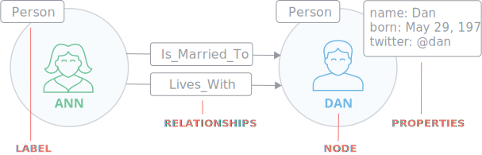
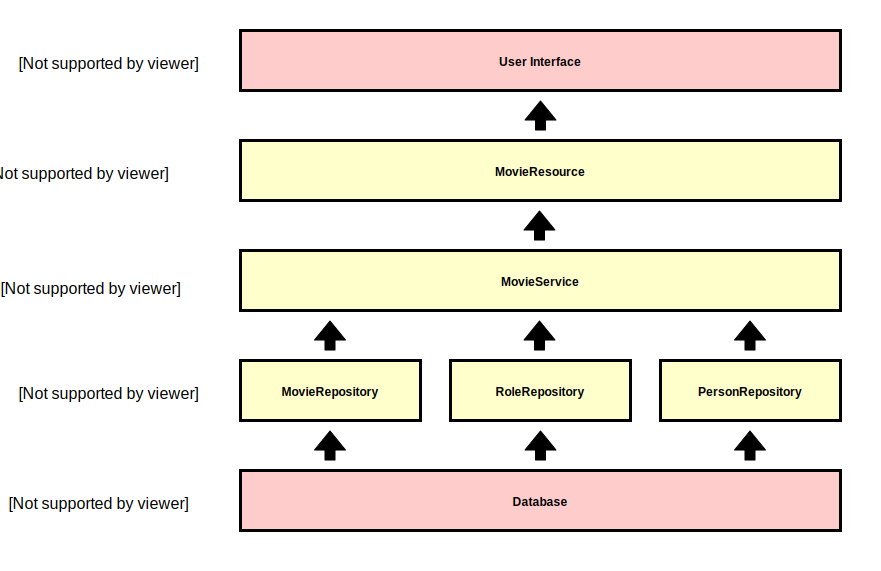
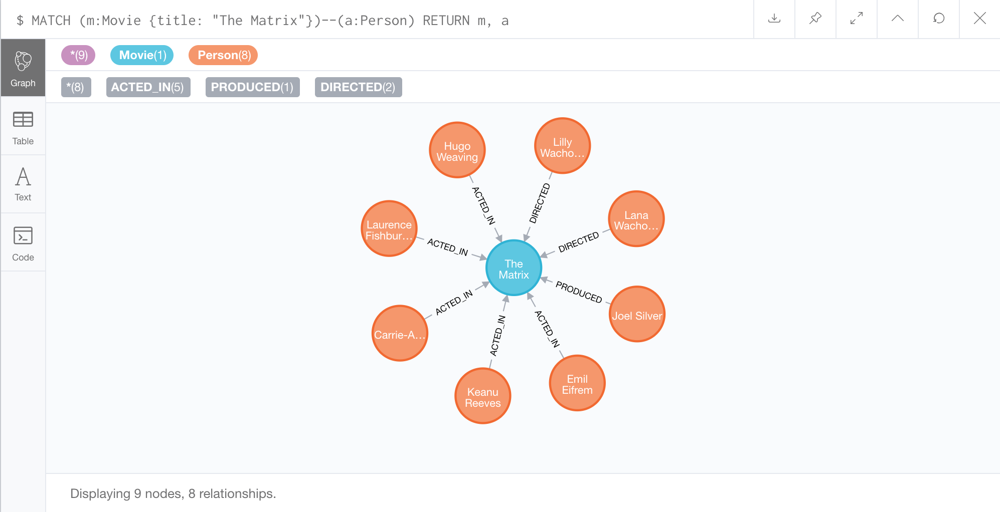
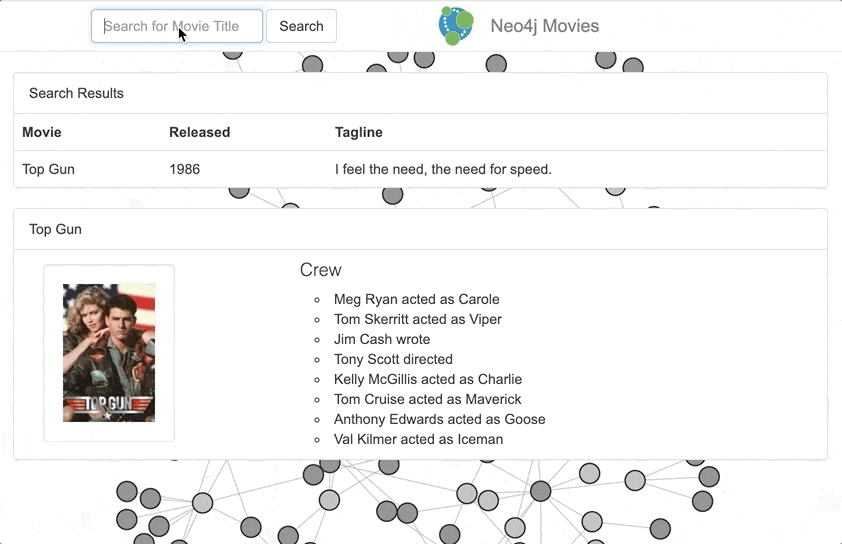

# Neo4j Movies Example Application with JNoSQL

## Table of Contents

- <a href="#introduction">Introduction</a>
- <a href="#neo4j-database">The Neo4j Database</a>
- <a href="#jnosql-framework">The JNoSQL Framework</a>
- <a href="#architecture">Architecture of the Application</a>
- <a href="#implementation">Implementation of the Application</a>
  - <a href="#database-setup">Setting up a Database Connection</a>
  - <a href="#entity-classes">Creating the Entity Classes</a>
  - <a href="#search-api">Getting the Data for the `*/api/search/?q={title}` API Endpoint</a>
  - <a href="#movies-api">Getting the Data for the `*/api/movies/{title}` API Endpoint</a>
  - <a href="#graph-api">Getting the Data for the `*/api/graph/` API Endpoint</a>
- <a href="#interpretation">Interpretation of the Results</a>

<a id="introduction"></a>
## Introduction

The goal of this project was to evaluate the current capabilities of
the JNoSQL Framework, which defines a set of standardized APIs and
implementations that enable Java programs to interact with NoSQL
databases without coupling them to a specific NoSQL technology [[1]].

To accomplish this, a sample application should be developed that allows
users to search for information about movies stored in a Neo4j database
through a web-based search interface.

The following sections are giving a quick overview of the main
technologies that were used (i.e. Neo4j and JNoSQL), followed
by a description of the architecture and implementation of the sample
application, as well as an interpretation of the achieved results.

<a id="neo4j-database"></a>
## The Neo4j Database 

Neo4j is Java-based graph database developed by Neo4j, Inc [[2]]. Being a
graph database, one of the main factors that distinguishes Neo4j from
SQL databases is that it doesn't store data in tables with rows and
columns, but instead uses a "Labeled Property Graph Model" with the
following components [[3]]:

- Nodes, which are the main data containers (somewhat comparable to tables),
- Relationships, which define how different nodes are connected to each other,
- Properties, which are the data values that are describing individual nodes and relationships (somewhat comparable to columns in a table), 
- Labels, which are used to group nodes into sets.

To make this model a bit clearer, let's take a look at the following
image from the Neo4j website [[3]]:

 

What we see are two nodes which are connected by a set of relationships.
Both nodes have a "Person" label, showing that the nodes are, indeed,
representing two people. When looking at their properties, we can see
that the first person is named Ann, while the second one is named Dan
and was born on May 29, 1970. A look at the connecting relationships
further reveals that Ann is married to Dan and lives with him.

While not explicitly shown in the graph, it is worth pointing out that
nodes are not limited to a single label, but can be assigned multiple
of them. Furthermore, the relationships could also contain additional
properties, like the date at which Ann married Dan. All relationships
in Neo4j are unidirectional, but queries (described in the following
paragraphs) can ignore the direction of a relationship if needed.

The query language that is usually used to interact with a Neo4j
database is named Cypher [[4]]. As with the database structure, the
syntax of a Cypher query is also quite different from SQL. For example,
to get the names of all the people in the database, one could use the
following query:

```Cypher
MATCH (p:Person) RETURN p.name
```

Of course, retrieving properties from nodes is not really the main draw
of a graph database such as Neo4j. Much more interesting are queries
that require graph traversal or gather information about relationships
between nodes. For example, to find all married people, one could use
the following query:

```Cypher
MATCH (p)-[:Is_Married_To]-() RETURN p
```
 
Since the above query is undirected, it would return both Ann and the
when executed against our little two-person-graph, even though there
is no Is_Married_To relationship that goes from Dan to Ann.  Changing
the query to:

```Cypher
MATCH (p)-[:Is_Married_To]->() RETURN p
```
 
(notice the `>` before the final parentheses) would take the direction
of the relationship into consideration, and therefore only return Ann.

Further information about the Cypher Query Language can be found in the
Neo4j Cypher Manual [[5]].

<a id="jnosql-framework"></a>
## The JNoSQL Framework

As shown in the previous section about Neo4j, the structure and query
languages for NoSQL databases can be quite different from the ones for
SQL databases. This is further complicated by the fact that even among
NoSQL databases, there are four main storage types that are usually
distinguished:

- Key-Value,
- Column,
- Document,
- Graph.

Because there is such a wide variety of NoSQL databases, and because
they are so different from SQL databases, technologies like JDBC and
JPA are not very well suited for working with them.

Other frameworks exist that are specifically tailored to work with NoSQL
databases. However, as with Neo4j's "Object Graph Mapping Library" [[6]],
they usually only support databases from a single vendor, thereby making
it very difficult to switch to a different vendor after development has
started.

The goal of the JNoSQL project [[1]] (which, as of 03.04.2019 was still in
the Project Proposal stage of the EE4J Bootstraping process [[7]][[8]]),
is to improve this situation by providing a set of standardized APIs and
implementations that enable Java programs to interact with NoSQL
databases without coupling them to a specific NoSQL technology. 

To achieve this, the JNoSQL project defines two layers:

- The Communication Layer (Eclipse JNoSQL - Diana) defines the APIs that
 handle the actual communication with different databases, with one API
 per type of NoSQL database (Key-Value, Column, Document and Graph). It
 can be compared to JDBC and the APIs are implemented by database
 specific drivers.
 
- The Mapping Layer (Eclipse JNoSQL - Artemis) is built on top of the
 Communication Layer and defines the APIs that are used to map Java
 objects to objects in NoSQL databases. Like with JPA, this layer is
 annotation driven and also integrates with technologies such as CDI
 and Bean Validation.
 
Instructions for setting up JNoSQL for a project can, for example,
be found on the "Getting Started" page of the JNoSQL website [[9]] as well
as the "Guide to Eclipse JNoSQL" on Baeldung [[10]]. 

Once the basic setup is done, annotations can be added to Java classes
to map them to database Entities:

```Java
@Entity
public class Person {

  @Id
  private long id;

  @Column
  private String name;
  
}
```

Depending on the type of NoSQL database, a KeyValueTemplate,
ColumnTemplate, DocumentTemplate or GraphTemplate is then used to
interact with the database (through an API based on Apache's Gremlin
Graph Traversal Language [[23]]):

```Java
public class PersonRepositoryBean implements PersonRepository {

    @Inject
    private GraphTemplate graph;

    @Override
    public Person findByName(String name) {
        return graph.getTraversalVertex()
            .hasLabel(Person.class)
            .has("name", name)
            .getSingleResult()
            .orElse(null);
    }
}
```

As with JPA, it is also possible to define Repositories without an
implementation by extending the Repository<T, ID> interface:

```Java
public interface PersonRepository extends Repository<Person, Long> {

    Person findByName(@Param("name") String name);

}
```

A more thorough description of the features of JNoSQL can be found in
the official JNoSQL documentation [[11]].

The <a href="#implementation">Implementation</a> and
<a href="#interpretation">Interpretation</a> sections will also go
into a bit more detail about some peculiarities and limitations that
have to be dealt with when using the current version of JNoSQL (0.0.8)
with a graph database. 

<a id="architecture"></a>
## Architecture of the Application

As described in the <a href="#introduction">Introduction</a> section,
the application that was created as part of this project is a simple
web-based search interface for information about movies. This example
was chosen because it is the same one that Neo4j uses to showcase the
different Neo4j drivers that are available for JDBC, Spring, etc.,
thereby allowing a rather easy and unbiased comparison of JNoSQL to
existing alternatives for accessing Neo4j databases.



As can be seen in the architecture image above, the user interface
retrieves the information that it shows from a REST API (which offers
endpoints for searching for movies by name, getting details about a
movie as well as getting a partial graph representation of the
database).

The REST API, in turn, simply passes any requests that it gets from the
user interface on to the service layer and returns the data that it gets
back as a JSON response.

The service layer passes the requests further on to the repositories
in the data access layer and combines/transforms the returned data into
a format that the REST resources can directly turn into JSON.

Finally, the data access layer executes any database queries that are
necessary to retrieve the required information from the database and 
returns the results back to the service layer for processing. 

The model for the data in the database (which is taken from Neo4j's
movie example database [[12]]) can be rather accurately described by the
following Cypher-like expression:

```Cypher
(:Person {name})-[:ROLE {characters}]->(:Movie {title,released})
```

This means that the database contains people (with a name) as well as
movies (with a title and release date), which are connected by
relationships describing the roles (actor, director, producer, etc.)
that the involved people had in the creation of a particular movie. For
people who were actors in a movie, the relationship also contains the
name of the character that they played.

A basic graph representation of this information for the movie "The
Matrix" can be seen in the image below (image produced using the Neo4j
Browser [[13]]).



<a id="implementation"></a>
## Implementation of the Application

To get a better feel for the functionality that should be provided
by the application, let's first take a look at the user interface of
one of the demo implementations created by the Neo4j team [[14]]:



As we can see, the basic flow goes something like this:

1. The user enters (part of) a movie title into the search field and
 submits the search form.
2. The application shows a list of matching movies. For the first
 movie in the list, it also shows some further details.
3. By clicking on the other movies in the search result list, the
 user can switch through the details of the different movies.

What might not be immediately obvious is that the D3 [[15]] graph in
the background is also created from actual database information about
some subset of actors and the movies that they played in.

The user interface (which was "borrowed" from Neo4j's Spring Data
implementation of the movie application [[16]] with only minor
changes) expects to get the data for these functionalities from the
following API endpoints:

- `*/api/search/?q={title}`, which should return a list of all the
 movies that contain the given title, including their release date
 and tagline(called when the user submits the search form).
- `*/api/movies/{title}`, which should return detailed information
 about the given movie, including the people that were involved in
 the movie's creation as well as their roles (called when the user
 klicks on one of the entries in the search results list),
- `*/api/graph/`, which should return a graph representation of
 a subset of all actors as well as the movies that they played in
 (called once when loading the page).

The remainder of this section will describe the implementation of
the these endpoints using a bottom-up approach. This should ensure
that all the necessary dependencies have been explained already
when they are being used. To bring a bit more structure into the
explanation, it is divided into the following subsections:

- <a href="#database-setup">Setting up a Database Connection</a>
- <a href="#entity-classes">Creating the Entity Classes</a>
- <a href="#search-api">Getting the Data for the `*/api/search/?q={title}` API Endpoint</a>
- <a href="#movies-api">Getting the Data for the `*/api/movies/{title}` API Endpoint</a>
- <a href="#graph-api">Getting the Data for the `*/api/graph/` API Endpoint</a>

The layers above the data access layer will not be described in
detail, since they are rather unspectacular and would only distract
from the focus of the explanation, which should be on JNoSQL.

<a id="database-setup"></a>
### Setting up a Database Connection

This project assumes that a Neo4j database with the necessary movie
data is available on `bolt://localhost:7687` (configurable through
the `jnosql.json` file in the META-INF directory). Instructions for
installing Neo4j can be found in the "Installation" chapter of the
Neo4j Operations Manual [[17]], while instructions for importing the
movie data are available on the "Dataset: Movie Database" page of
the Neo4j website [[18]].

To be able to access this database through Java, the following
dependencies are defined in the `pom.xml` file:

- `org.jnosql.artemis.artemis-graph`
- `org.jnosql.artemis.artemis-configuration`
- `org.apache.tinkerpop.gremlin-core`
- `org.apache.tinkerpop.gremlin-groovy`
- `com.steelbridgelabs.oss.neo4j-gremlin-bolt`
- `org.neo4j.driver.neo4j-java-driver`

The list of dependencies is quite a bit longer than what one would
find when using a key-value, column or document database, which
generally only need the Artemis dependencies and a single Diana
driver (`org.jnosql.diana.*-driver`). This is due to the fact that
JNoSQL does not itself define or implement a Communication API for
graph databases, but instead relies on Apache TinkerPop [[19]] for
communication with graph databases [[20]].

The last step of the process for setting up a database connection is
to create a class that produces a `(Neo4j)Graph`:

```Java
@ApplicationScoped
public class GraphProducer {

    private Graph graph;

    @PostConstruct
    public void init() {
        ...

        // read url, user and password from jnosql.json

        AuthToken basic = AuthToken.basic(user, password);
        Driver driver = GraphDatabase.driver(url, basic);

        this.graph = new Neo4JGraph(driver, ...);
    }

    @Produces
    @ApplicationScoped
    public Graph getGraph() {
        return graph;
    }

    public void close(@Disposes Graph graph) throws Exception {
	    graph.close();
	    driver.close();
    }
}
```

JNoSQL uses this Graph to create a `GraphTemplate` from it, which can
be used by the application to send requests to the database (quite
similar to JPA's `EntityManager`).

In the actual implementation, the logic to create the Graph is split
into two classes, `DriverProducer` and `GraphProducer`, to more
clearly separate the creation and configuration of the driver and
the creation of the graph itself.


<a id="entity-classes"></a>
### Creating the Entity Classes

The creation of the Entity classes seems quite straightforward at
first. Mapping movie data to a `Movie` class and person data to a
`Person` class can be achieved through the following code:

```Java
public class Movie {

    @Id
    private Long id;

    @Column
    private String title;

    @Column
    private int released;

    @Column
    private String tagline;

}
```

```Java
@Entity
public class Person {

    @Id
    private Long id;

    @Column
    private String name;

    @Column
    private int born;

}
```

Where things start to break down very quickly, however, is when
trying to map the role relationship that connects people with movies.
This is because JNoSQL does not appear to offer a way to define
relationships between entities in its current version (0.0.8).

A look at the current status of the JNoSQL specification pretty much
confirms this. In the section about annotations [[21]], the only ones
that are listed are the following:

- `@Entity`
- `@Column`
- `@MappedSuperclass`
- `@Id`
- `@Embeddable`
- `@Convert`

Although not necessarily surprising (given the fact that JNoSQL is
still in the Project Proposal stage of the EE4J bootstrapping process
[[7]]), this unfortunately means that only a partial implementation
of the planned features of the application was possible. Which
features could and which features couldn't be implemented is
explained in more detail in the following subsections.

<a id="search-api"></a>
### Getting the Data for the `*/api/search/?q={title}` API Endpoint

The search functionality is the only one of the three main parts of
the application (search, movie details, graph) that was fully
implemented. The part of the data access layer that is responsible
for the data retrieval of the search is shown below.

```Java
public class MovieRepositoryBean implements MovieRepository {

    @Inject
    private GraphTemplate graph;

    @Override
    public List<Movie> findByTitleLike(String title) {
        return graph.getTraversalVertex()
            .hasLabel(Movie.class)
            .<Movie>filter((i) -> i.getTitle().contains(title))
            .getResultList();
    }

    ...
}
```

According to the JNoSQL documentation, it should also have been
possible to implement this query the following way:

```Java
public interface MovieRepository extends Repository<Movie, Long> {

    List<Movie> findByTitleLike(@Param("title") String title);

}
```

However, although "Like" is listed as one of the supported operators
for JNoSQL's "Query by method" functionality [[22]], trying out this
implementation failed with a message saying that the "Like" operator
is not currently supported for graph databases.

<a id="movies-api"></a>
### Getting the Data for the `*/api/movies/{title}` API Endpoint

For this API endpoint, only the actual movie information (title,
release date, tagline) is returned:

```Java
public class MovieRepositoryBean implements MovieRepository {

    @Inject
    private GraphTemplate graph;

    @Override
    public Movie findByTitle(String title) {
        return graph.getTraversalVertex()
            .hasLabel(Movie.class)
            .has("title", title)
            .<Movie>getSingleResult()
            .orElse(null);
    }

    ...
}
```

What's missing is the crew information. While the names of the crew
members could be retrieved through an additional query like the one
that is shown below, there still wouldn't be a (clean, JNoSQL based)
way to get their roles, because of JNoSQL's current lack of support
for relationship annotations.

```Java
public class PersonRepositoryBean implements PersonRepository {

    @Inject
    private GraphTemplate graph;

    @Override
    public List<Person> findByMovie(String movie) {
        return graph.getTraversalVertex()
            .hasLabel(Movie.class).has("title", movie)
            .in().hasLabel(Person.class)
            .getResultList();
    }
}
```

<a id="graph-api"></a>
### Getting the Data for the `*/api/graph/` API Endpoint

The graph API endpoint has no working implementation at all. Instead,
it simply returns an empty result for all requests.

As with the movies API endpoint, this is primarily caused by JNoSQL's
current lack of support for relationship annotations. Of course, one
could work around this limitation by first getting all the movies and
then getting the crew members for each movie individually to rebuild
the graph representation manually in Java code, but this would largely
defeat the purpose of having a graph database and is not really a
scalable solution.

<a id="interpretation"></a>
## Interpretation of the Results

As described in the <a href="#implementation">Implementation</a>
section, the main problem that was encountered during the creation
of this project was the rather limited mapping layer of the current
JNoSQL version (0.0.8). Just the fact that relationships between
entities cannot be mapped seems to be enough of a drawback on its own
to pretty much disqualify JNoSQL from being a viable option for any
sort of serious production use that involves a graph database.

Graph database support in general seemed to be kind of a second class
citizen. To be a bit more specific:

-   Finding the right Maven dependencies: JNoSQL offers drivers
    for key-value, column and document databases. For graph databases,
    there is no such driver, and the "Get Started" page of the JNoSQL
    website only says to "Choose any Graph with TinkerPop support"
    [[9]], with a link to the home page of the TinkerPop website
    [[19]].

    After a while, I did find JNoSQL's "artemis-demo" project on GitHub,
    which contains an example for Neo4j (including a pom.xml file)
    [[24]], but it isn't pointed out anywhere that this project exists,
    and I definitely didn't find the information that I needed on the
    linked TinkerPop home page (which, admittedly, might be my own
    fault).

-   Finding the _actually_ right Maven dependencies: After adding `@Query`
    annotations [[25]] to methods in a `Repository<T, ID>` interface, I
    always got a `NoClassDefFound` error when trying to access the
    corresponding functionality in the deployed application.

    Turns out that the dependencies from the artemis-demo project were
    not enough for that use case, and I actually needed an additional
    `org.apache.tinkerpop.gremlin-groovy` dependency to get the `@Query`
    annotations to work.

-   Writing `@Query` annotations [[25]]: It was not obvious to me which
    query language I should use inside of `@Query` annotations. Looking
    at the JNoSQL documentation, it points out the following about this:

    > Remember, when a developer defines who that repository will be
    > implemented from the CDI qualifier, the query will be executed to
    > that defined type, given that, gremlin to Graph, JNoSQL key to
    > key-value and so on. [sic?]

    In hindsight, it is clear to me now that this is supposed to say
    that one has to use Gremlin to write queries for graph databases,
    but I spent far more time trying to find errors in my Cypher
    queries than I would like to admit.

-   Using the "Query by method" functionality [[22]]: As described in
    the <a href="#search-api">search API</a> subsection, I tried to use
    a `findByTitleLike` method in a `Repository<T, ID>` interface.
    According to the documentation, "Like" is a valid operator, but
    when I accessed the corresponding functionality in the deployed
    application, I got an error which informed me that the "Like"
    operator is not currently supported for graph databases.

I think that many of these problems would not apply when using
JNoSQL with other types of NoSQL databases (i.e.  key-value, column
or document). However, I'm somewhat hesitant to describe this as a
purely good thing. After all, it is especially frustrating if,
according to the documentation, things should work for all types of
NoSQL databases, but turn out not to do so when actually implementing
them for a graph database.

Having said all of this, I still think that the JNoSQL project is
definitely a very meaningful effort, and, given its early stage of
development (Project Proposale stage of the EE4 bootstrapping
process [[7]]), I'm rather impressed by all the things that do
already work, as well as the fact that documentation exists for
pretty much all of it. Although it might take a while, I wouldn't
rule out a future in which JNoSQL is as established in the realm of
NoSQL databases as JDBC and JPA are in the realm of SQL databases
today.

[1]: http://www.jnosql.org/index.html#about
[2]: https://en.wikipedia.org/wiki/Neo4j
[3]: https://neo4j.com/product/#basics
[4]: https://neo4j.com/developer/cypher-query-language/
[5]: https://neo4j.com/docs/cypher-manual/
[6]: https://neo4j.com/docs/ogm-manual/
[7]: https://www.eclipse.org/ee4j/status.php
[8]: https://projects.eclipse.org/proposals/jakarta-nosql
[9]: http://www.jnosql.org/getting_started.html
[10]: https://www.baeldung.com/eclipse-jnosql
[11]: http://www.jnosql.org/doc/
[12]: https://neo4j.com/developer/movie-database/
[13]: https://neo4j.com/developer/guide-neo4j-browser/
[14]: http://my-neo4j-movies-app.herokuapp.com/
[15]: https://d3js.org/
[16]: https://github.com/neo4j-examples/movies-java-spring-data-neo4j
[17]: https://neo4j.com/docs/operations-manual/current/installation/
[18]: https://neo4j.com/developer/movie-database/
[19]: http://tinkerpop.apache.org/
[20]: http://www.jnosql.org/doc/#_let_s_not_reinvent_the_wheel_graph
[21]: https://github.com/JNOSQL/jnosql-specification/blob/d25602eb9fe174ff982de5d07be905c936a9cd49/spec/src/main/asciidoc/annotations.adoc
[22]: http://www.jnosql.org/doc/#_query_by_method
[23]: https://tinkerpop.apache.org/gremlin.html
[24]: https://github.com/JNOSQL/artemis-demo/tree/c38318884858df4b93ef52a43ac0df4e914766b6/artemis-demo-java-se/graph-neo4j-remote
[25]: http://www.jnosql.org/doc/#_using_query_annotation
